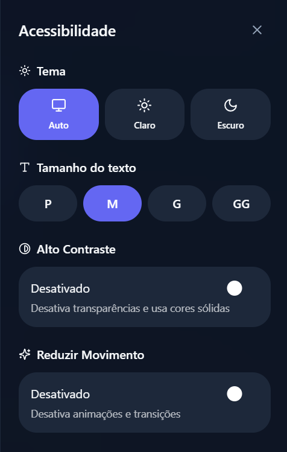

# FinTrack
App de Finanças Pessoais

## Sobre o Projeto
O FinTrack é um aplicativo de finanças pessoais focado em simplicidade, rapidez e clareza visual.  
Ele permite registrar gastos e ganhos de forma guiada, sem uso de inteligência artificial, usando apenas regras bem definidas para interpretar os dados inseridos pelo usuário.

O objetivo é facilitar o controle financeiro diário com uma interface moderna, acessível e fácil de usar.

## Prompt Final / PRD

Nome do Projeto: FinTrack  
Estilo Visual: Glassmorphism + Material Design 3  
Lógica: Determinística (sem IA)

### Visão Geral
O FinTrack prioriza uma experiência visual limpa e interações rápidas.  
O design utiliza transparências, desfoque de fundo e cores sólidas para diferenciar ganhos, gastos e metas.

### Acessibilidade
O app oferece um painel de acessibilidade disponível em todas as telas, com:
- Ajuste de tamanho de texto
- Modo escuro automático ou manual
- Modo de alto contraste
- Redução de animações

### Entrada de Dados
A entrada de informações segue um diálogo guiado, sem linguagem natural por IA.

Regras principais:
- Apenas números abrem a seleção de categoria
- Número + texto define valor e descrição
- Texto + número define descrição e valor

### Funcionalidades
- Registro rápido de gastos e ganhos
- Monitor de assinaturas mensais
- Divisor de contas entre pessoas
- Metas visuais com progresso

### Telas

- Dashboard com saldo, gráfico e transações recentes

- Tela de interação guiada para novos registros

- Tela de ajustes e acessibilidade

### Critérios de Aceite
- Interface totalmente navegável por teclado
- Efeito visual de transparência funcional
- Regex funcionando corretamente para entrada de dados
- Modo escuro com boa legibilidade

## Reflexão sobre o Processo

O que funcionou bem:
- A lógica determinística deixou o fluxo previsível e fácil de testar
- O diálogo guiado simplificou a experiência do usuário
- A separação clara entre UI e regras de negócio

O que não funcionou como esperado:
- Ajustar acessibilidade junto com efeitos visuais exigiu mais refinamento
- Balancear estética e contraste foi um desafio

O que aprendi sobre conversar com IAs:
- Um prompt bem estruturado gera resultados mais consistentes
- Detalhar regras evita ambiguidades
- Iterar e refinar o pedido melhora muito a qualidade final
